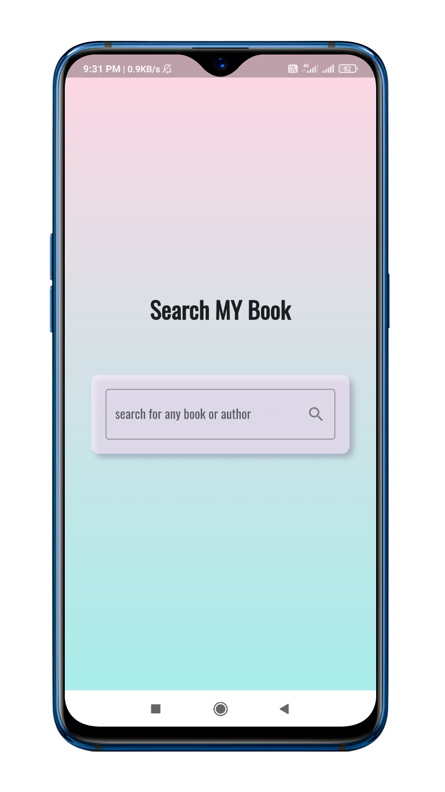
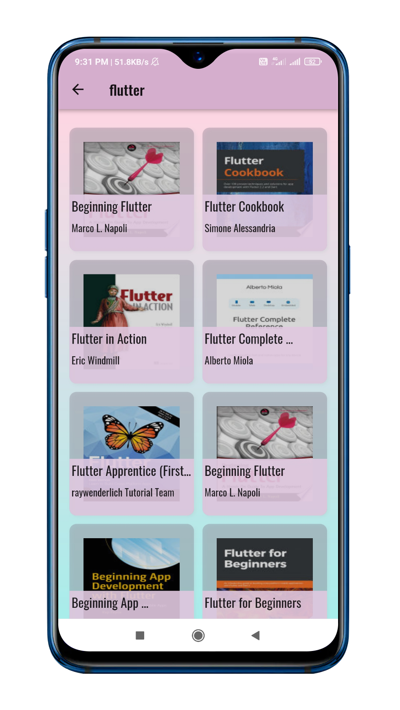
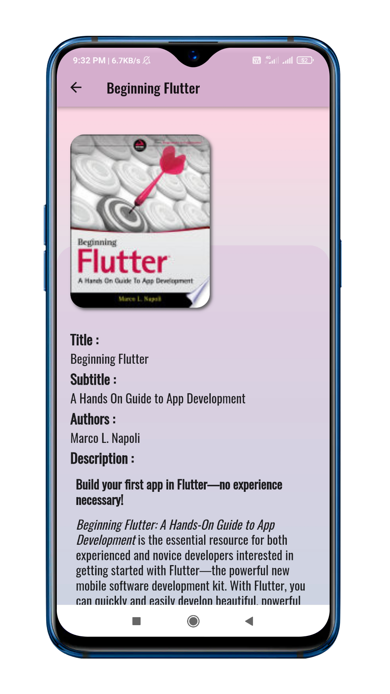

# search_my_book

It is a Flutter project based on [Google Book api](https://developers.google.com/books/docs/overview)

## project description

This is a basic app in which user can make a query and get a list of books in return on which user can click and get details.

## technologies used
- flutter
- dart
- restful api

## screenshots

*any contribution will be appreciated.*
